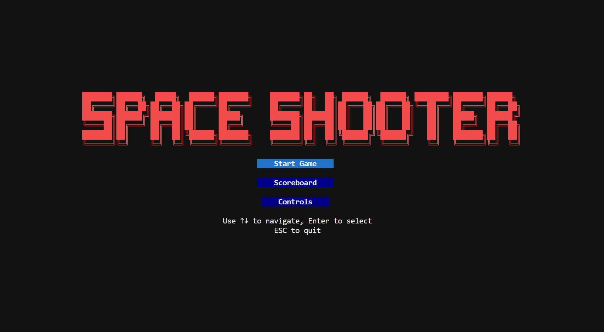

# SPACE SHOOTER!

<p align="center">
   <span>COMP2113 Group Project</span>
</p>

<p align="center">
   
   <br/>
   <span> COMP2113 Group Presents (2025/26 Spring Semester)</span>
</p>

## Team Members

- **SHAWN ZHANG** (u3653854@connect.hku.hk)

## Overview

Welcome to _SPACE SHOOTER_, a high-octane, terminal-based shooting game where quick reflexes and tactical thinking are your keys to survival. Survive waves of descending enemies, upgrade your weapons, and become the ultimate sharpshooter!

## Table of Contents

- [Gameplay](#gameplay)
- [Features](#features)
- [How to Play](#how-to-play)
- [Technical Details](#technical-details)
- [Build Instructions](#build-instructions)

## Gameplay

You are the lone warrior in a hostile arena. Enemies spawn from the top of the screen and descend toward you. Your mission: **shoot to survive, survive to dominate**.

- **Eliminate enemies** to earn cash and score points
- **Buy upgrades** in the shop (press P during gameplay)
- **Progress through waves** - each wave brings tougher enemies
- **Random events** every 2 waves add variety to gameplay
- **Choose your difficulty** - Easy, Medium, or Hard

## Features

### Weapon System
- **Basic Pistol**: Single-shot firing
- **Dual Shot**: Fires two bullets simultaneously
- **Tri Shot**: Fires three bullets in a spread pattern

### Bullet Types
- **Basic**: Standard damage
- **Explosive**: Area damage on impact (16 fragments in a circle)
- **Piercing**: Passes through enemies, has penetration count

### Enemy Types
| Enemy | HP | Behavior |
|-------|-----|----------|
| Regular | 1 | Formation movement (left-right) |
| Elite | 3 | Random diagonal movement |
| Circle Shooter | 5 | Stationary, shoots expanding circle of bullets |
| Boss | 15 | Erratic movement, shoots at player |
| Megaboss | 60 | Slow movement, shoots 3-way spread |
| Dropship | 120 | Spawns bosses, streams bullets |

### Random Events (Every 2 Waves)
- **Player Buffs**: Super Charge!, Power Surge!, Lightning Speed!, Quick Cash!, etc.
- **Enemy Debuffs**: Time Dilation!, Fatigue!, Scattered!, etc.
- **Enemy Buffs**: Frenzy!, Armored!, Swarm!, etc.
- **Player Debuffs**: Jammed!, Drought!, etc.

### Shop System
- **Weapons**: Dual Shot ($100), Tri Shot ($300)
- **Bullet Unlocks**: Explosive ($300), Piercing ($500)
- **Upgrades**: Damage, Speed, Blast Radius, Penetration
- **Items**: Speed Boost, Health Pack, Shield Pack, Damage Boost
- **Abilities**: Shield Barrier, Rapid Fire, Time Slow, Freeze

### Difficulty Levels
| Difficulty | Cash Reward | Enemy HP | Enemy Damage | Spawn Toughness |
|------------|-------------|----------|--------------|----------------|
| Easy | +50% | -30% | -30% | -30% |
| Medium | 100% | 100% | 100% | 100% |
| Hard | -30% | +50% | +50% | +40% |

## How to Play

### Controls
| Key | Action |
|-----|--------|
| ↑/↓/←/→ or WASD | Move player |
| SPACE | Shoot |
| P | Open shop (during gameplay) |
| Q | Return to main menu |
| ESC | Pause/Resume |

### Shop Controls
| Key | Action |
|-----|--------|
| ←/→ | Switch category |
| ↑/↓ | Select item |
| ENTER | Buy/Upgrade |
| P or ESC | Resume game |

### Build & Run
```bash
cd home
mkdir build
cd build
cmake ..
cmake --build . -- -j4
./Shooter_game
```
You may checkout to mac and build the project if some of the display looks wrong.

### Terminal Requirements
Minimum terminal size: 107 x 39 characters

## Technical Details

### Architecture
- **FTXUI** library for terminal-based rendering
- **Object-Oriented Design** with classes: Game, Player, Enemy, Bullet, Weapon
- **Component-based UI**: MenuRenderer, ShopRenderer, HUD
- **Strategy Pattern**: Weapon system with different firing patterns

### Key Classes
- `Game` (core/game.hpp): Main game engine, handles update loop, spawning, collisions
- `Player` (entities/player.hpp): Player state, movement, health, shield
- `Enemy` (entities/enemy.hpp): 6 enemy types with unique behaviors
- `Weapon` (weapons/weapon.hpp): Strategy pattern for firing patterns
- `Shop` (ui/shop.hpp): Item management and purchase logic

### File Structure
```
home/
├── src/
│   ├── core/        # Main game engine
│   ├── data/        # High score persistence
│   ├── entities/    # Player, Enemy, Bullet
│   ├── ui/          # Menu, Shop, HUD
│   └── weapons/      # Weapon system
├── thirdparty/      # FTXUI library
├── CMakeLists.txt
└── README.md
```

---

### Technical Implementation Details

#### 1. Generation of Random Events

The game implements random event generation using C++'s standard random utilities. Every 2 waves, a random event is selected from a predefined event library containing 19 unique events across 4 categories:

```cpp
const std::vector<RandomEvent> event_library = {
    {"Super Charge!", "Fire rate doubled for this wave", EventType::PLAYER_BUFF, 0},
    {"Power Surge!", "+50% bullet damage for this wave", EventType::PLAYER_BUFF, 0},
    // ... more events
};
```

The selection uses `rand() % event_library.size()` to ensure uniform randomness. Events are applied globally for the entire wave duration, affecting either:
- Player stats (fire rate, damage, speed, cash rewards)
- Enemy stats (movement speed, HP, damage, spawn rate)
- Combined effects (bonuses and penalties)

#### 2. Data Structures for Storing Data

The game uses STL containers extensively:

| Data Type | Container | Purpose |
|-----------|-----------|---------|
| Active bullets | `std::vector<Bullet>` | Player's fired bullets |
| Active enemies | `std::vector<Enemy>` | Enemies on screen |
| Shop items | `std::vector<ShopItem>` | Purchasable items |
| High scores | `std::vector<ScoreEntry>` | Leaderboard data |
| Event library | `std::vector<RandomEvent>` | Predefined events |
| Available enemies | `std::vector<std::pair<EnemyType, int>>` | Viable spawn types |

The `ShopItem` struct demonstrates structured data storage:
```cpp
struct ShopItem {
    std::string name;
    std::string description;
    int cost;
    ItemCategory category;
    bool owned;
    bool can_stack;
    int quantity;
    int max_quantity;
    int upgrade_level;
    int max_upgrade_level;
};
```

#### 3. Dynamic Memory Management

- **Weapon Creation**: Uses factory pattern with `std::unique_ptr` for weapon objects
```cpp
std::unique_ptr<Weapon> CreateWeapon(WeaponType type);
```
- **Bullet Management**: Bullets are dynamically created and removed when off-screen or collided
- **Enemy Spawning**: New enemies created via constructor with random positions
- **Smart Pointers**: The weapon system uses `std::unique_ptr<Weapon>` to manage weapon lifecycle automatically

#### 4. File Input/Output

The game implements file I/O for high score persistence:

**Loading scores** (data/highscore.cpp):
```cpp
std::ifstream file(filename);
while (std::getline(file, line)) {
    // Parse: name,score,wave
    scores.push_back(entry);
}
```

**Saving scores** (data/highscore.cpp):
```cpp
std::ofstream file(filename);
for (const auto& score : top_scores) {
    file << score.player_name << "," << score.score << "," << score.wave << "\n";
}
```

Scores are stored in `data/highscores.txt` with CSV format: `name,score,wave`

#### 5. Program Codes in Multiple Files

The project follows modular design with clear separation of concerns:

| Directory | Files | Responsibility |
|----------|-------|-------------|
| `core/` | main.cpp, game.cpp, game.hpp, types.hpp | Main game loop, state management |
| `data/` | highscore.cpp, highscore.hpp | Score persistence |
| `entities/` | player.cpp, player.hpp | Player entity |
| `entities/` | enemy.cpp, enemy.hpp | Enemy entities and AI |
| `entities/` | bullet.cpp, bullet.hpp | Bullet physics |
| `ui/` | menu.cpp, menu.hpp | Main menu, scoreboard, controls |
| `ui/` | shop.cpp, shop.hpp | Shop item management |
| `ui/` | shop_renderer.cpp, shop_renderer.hpp | Shop UI rendering |
| `ui/` | hud.cpp, hud.hpp | Heads-up display |
| `weapons/` | weapon.cpp, weapon.hpp | Weapon strategy pattern |

Each file contains related functionality, making the codebase maintainable and extensible.

#### 6. Multiple Difficulty Levels

The game implements three difficulty levels affecting game balance:

```cpp
enum class DifficultyLevel {
    Easy,
    Medium,
    Hard
};

// Difficulty multipliers applied to game mechanics
float GetCashRewardMultiplier() const;      // Easy: +50%, Medium: 100%, Hard: -30%
float GetEnemyDamageMultiplier() const;     // Easy: -30%, Medium: 100%, Hard: +50%
float GetEnemyHealthMultiplier() const;    // Easy: -30%, Medium: 100%, Hard: +50%
float GetToughnessMultiplier() const;     // Easy: -30%, Medium: 100%, Hard: +40%
```

Difficulty is selected via a dedicated menu screen between the main menu and gameplay. The selection is stored in the `Game` object and affects:
- **Enemy HP**: Scaled by difficulty multiplier
- **Enemy Damage**: Scaled when player is hit
- **Cash Rewards**: Scaled per enemy kill
- **Toughness Budget**: Affects number of enemies spawned per wave

Difficulty selection screen:
```
╔═══════════════════════════════════════════════════════════════════╗
║            SELECT DIFFICULTY LEVEL                              ║
╚═══════════════════════════════════════════════════════════════════╝
    EASY    | +50% Cash | -30% Enemy HP | -30% Enemy Damage
    MEDIUM  | Normal Cash | Normal Enemy HP | Normal Enemy Damage
    HARD   | -30% Cash | +50% Enemy HP | +50% Enemy Damage
```

---

### Coding Requirements Checklist
- ✅ **Random event generation**: 19 unique random events every 2 waves
- ✅ **Data structures**: STL vectors, pairs, enums
- ✅ **Dynamic memory management**: Smart pointers, runtime object creation
- ✅ **File I/O**: High score loading/saving
- ✅ **Multiple source files**: 10+ files in modular structure
- ✅ **Multiple difficulty levels**: Easy, Medium, Hard with 4 different modifiers

## License

This project is for educational purposes.
